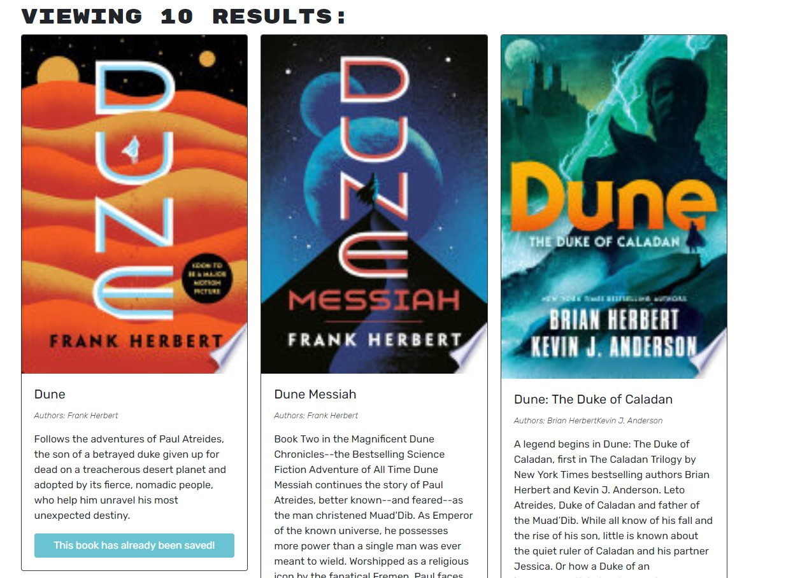

# Book Search

## Description
Book Search is a fun and easy way to search for and save books you are interested in. Enter any search and get a list of relevant books with titles, authors, images, links and descriptions. Sign up or login to save your favorite books! 

Book search is built using:
  - MongoDB
  - Express
  - React
  - Node
  - GraphQL
  - Apollo-Server
  - JSON Web Tokens for user authentication
 

### [Deployed Application](https://book-search-3000.herokuapp.com/)

### Screenshot

## Questions

- Feel free to reach out with any questions

## License
- MIT

### Contact information:
- GitHub: [jchavezval](https://www.github.com/jchavezval)
- Email: [jmchv20011@gmail.com](mailto: jmchv2001@gmail.com)